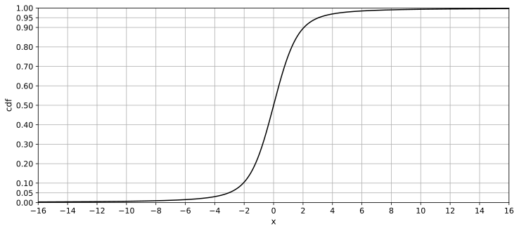

# HoltsmarkDistribution
 
In probability theory, the Holtsmark distribution is a probability distribution named after Johan Peter Holtsmark, In 1919.  
It's especially used in astrophysics for modeling gravitational bodies.  

This distribution is a special case of a stable distribution with shape parameter &alpha; = 3/2 and skewness parameter &beta; = 0.  

Such a distribution with &beta; = 0 is called symmetric alpha-stable distribution.  
- &alpha; = 2: Normal distribution
- &alpha; = 1: Cauchy distribution

The Holtsmark distribution, like these distribution, has a closed-from expression, but it can't be expressed in terms of elementary function.  

  
  
  

## Definition
The Holtsmark distribution, generalized to a stable distribution by introducing position and scale parameters, is as follows:  
  

Since scaling and translations allow for standardization, standard parameters are discussed here.  
  
  

## Numerical Evaluation
Using hypergeometric function, it's obtained as follows:  
  

The following series expression can also be used:  
  

When x is large, the following equation can be used as an asymptotic expression:  
  

Evaluating only one term of this equation yields the tail power of the distribution:  
  

## Statistics

|stat|x|note|
|----|----|----|
|mean|0||
|mode|0||
|median|0||
|variance|N/A|undefined|
|0.75-quantile|0.9689331817135830052087863130496...||
|0.9-quantile|2.061462638139193764464365388228...||
|0.95-quantile|3.051940973238316697189330345356...|
|0.99-quantile|7.736446206485418555263326182069...||
|entropy|2.069448505134624400315580038454...||

## Numeric Table
[PDF Precision 150](results/pdf_precision150.csv)  
[CDF Precision 150](results/cdf_precision150.csv)  
[Quantile Precision 142](results/quantile_precision142.csv)  

## Double Precision (IEEE 754) Approx
[FP64](https://github.com/tk-yoshimura/HoltsmarkDistributionFP64)

## S&alpha;S Distributions
  
  

## Reference
[J.Holtsmark, "Uber die Verbreiterung von Spektrallinien" (1919)](https://zenodo.org/records/1424343)  
[J.C.Pain "Expression of the Holtsmark function in terms of hypergeometric 2F2 and Airy Bi functions" (2010)](https://arxiv.org/abs/2001.11893)  

## See Also
[SASPoint5Distribution](https://github.com/tk-yoshimura/SASPoint5Distribution)
